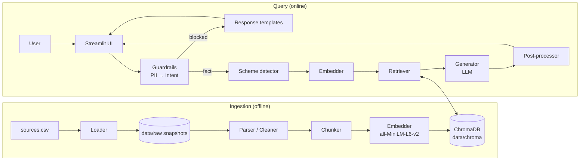
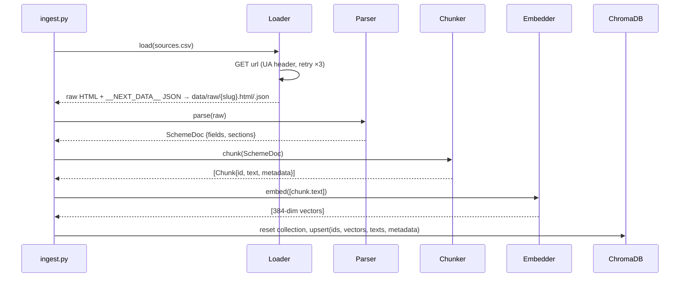
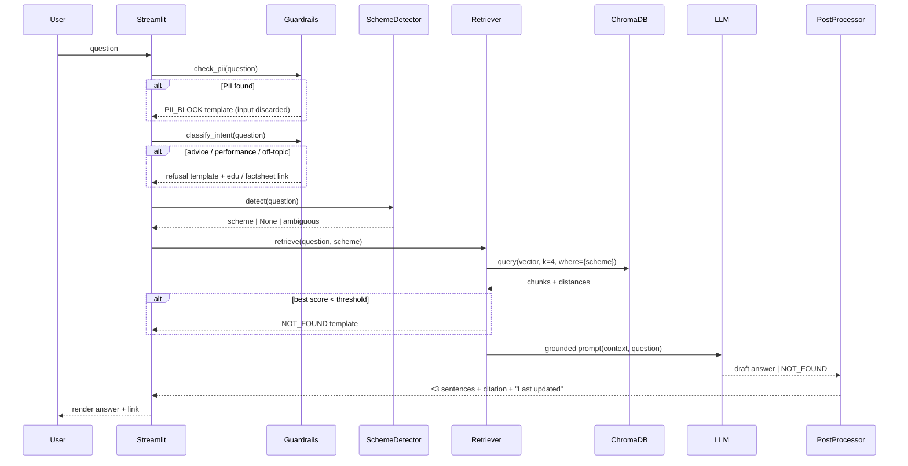

# Architecture: Mutual Fund FAQ Assistant (Facts-Only RAG Chatbot)

| | |
|---|---|
| **Status** | Draft v1 |
| **Date** | 2026-09-27 |
| **Based on** | [PRD.md](PRD.md) |

---

## 1. Overview

The system has two pipelines that share one vector store:

1. **Ingestion (offline, run once or on demand).** Load → Clean → Chunk → Embed → store in ChromaDB.
2. **Query (online, per user message).** Guardrails → Retrieve → Generate → Post-process → Render.

Everything runs locally except the LLM call: embeddings run on CPU and ChromaDB persists to disk. The LLM only turns retrieved context into a sentence. It never decides the facts, the citation, or whether a question is allowed.



## 2. Components

| # | Component | Module | Responsibility |
|---|---|---|---|
| 1 | Source registry | `sources.csv` | Lists every URL with its scheme, category and source type. This is the single source of truth for the corpus. |
| 2 | Loader | `src/loader.py` | Fetches each URL and saves the raw HTML and embedded JSON to `data/raw/`. |
| 3 | Parser | `src/parser.py` | Extracts structured fields and text sections from the raw snapshots. |
| 4 | Chunker | `src/chunker.py` | Builds section-aware chunks and one facts card per scheme, and attaches metadata. |
| 5 | Embedder | `src/embedder.py` | Wraps `sentence-transformers/all-MiniLM-L6-v2`. The same instance is used for ingestion and queries. |
| 6 | Vector store | `src/store.py` | Wraps the ChromaDB persistent client: upsert, query, reset. |
| 7 | Ingestion runner | `src/ingest.py` | Runs components 2–6 end to end. |
| 8 | Guardrails | `src/guardrails.py` | PII detection, then intent classification (fact / advice / performance / off-topic). |
| 9 | Scheme detector | `src/schemes.py` | Maps names and aliases to a canonical scheme, used as a retrieval filter. |
| 10 | Retriever | `src/retriever.py` | Embeds the query, runs a filtered top-k search, applies the similarity threshold. |
| 11 | Generator | `src/generator.py` | Builds the prompt, calls the LLM, returns text or `NOT_FOUND`. |
| 12 | Post-processor | `src/postprocess.py` | Caps answers at 3 sentences, scans for advice phrases, attaches the citation and the "Last updated" line. |
| 13 | Response templates | `src/templates.py` | Fixed text for refusals, PII blocks, not-found and clarification replies. |
| 14 | Pipeline | `src/pipeline.py` | `answer(question) -> Response`, which wires components 8–13 together. |
| 15 | UI | `app.py` | Streamlit chat: welcome line, example questions, disclaimer, citation links. |
| 16 | Config | `src/config.py` | Paths, model names, thresholds, environment variables. |

## 3. Ingestion pipeline



### 3.1 Loading
- `requests` with a browser User-Agent, a 15 s timeout and 3 retries with backoff.
- Groww pages are Next.js apps. The loader pulls the `<script id="__NEXT_DATA__">` JSON, which holds structured fund data, and also saves the rendered HTML. If both are empty, it falls back to Playwright.
- Every snapshot is saved with its `fetched_at` date. This gives three things:
  - ingestion can be re-run offline;
  - the demo doesn't depend on Groww being reachable;
  - the "Last updated from sources" date is traceable.

### 3.2 Parsing
Each page is turned into a `SchemeDoc`:

```python
@dataclass
class SchemeDoc:
    scheme: str            # "HDFC Small Cap Fund"
    category: str          # "Small Cap"
    source_url: str
    fetched_at: str        # ISO date
    fields: dict[str, str] # {"expense_ratio": "0.67%", "exit_load": "...", "min_sip": "₹100", ...}
    sections: dict[str, str]  # {"Investment Objective": "...", "Fund Manager": "...", ...}
```

The parser prefers the structured JSON and uses the HTML text only when a field is missing there. Values are kept **verbatim**: no rounding, no reformatting.

Target fields:

| Group | Fields |
|---|---|
| Costs and limits | `expense_ratio`, `exit_load`, `min_sip`, `min_lumpsum`, `lock_in` |
| Classification | `riskometer`, `benchmark`, `category` |
| Fund details | `fund_manager`, `aum`, `launch_date`, `tax_note` |

### 3.3 Chunking (from PRD §7.2)

| Rule | Detail |
|---|---|
| Facts card | One chunk per scheme listing every key field as `Label: value` lines. It serves most questions. |
| Section chunks | One chunk per section if it is ≤ 200 tokens. |
| Long prose | Split recursively (paragraph → sentence) into 200-token chunks with a 30-token overlap. |
| Context prefix | Every chunk text starts with `[<Scheme> – Direct Growth] [<Section>]`. |
| Token budget | Measured with the MiniLM tokenizer. The hard cap is 256, so the target of 200 leaves room for the prefix. |
| Chunk ID | `{scheme_slug}:{section_slug}:{n}`. The ID is deterministic, so re-ingesting overwrites old chunks instead of duplicating them. |

Example facts card:
```
[HDFC Small Cap Fund – Direct Growth] [Key Facts]
Expense ratio: 0.67%
Exit load: 1% if redeemed within 1 year
Minimum SIP: ₹100
Lock-in: None
Riskometer: Very High
Benchmark: BSE 250 SmallCap TRI
```
*(These values are illustrative; the real values come from the snapshot.)*

### 3.4 Embedding and storage
- **Model:** `sentence-transformers/all-MiniLM-L6-v2`, 384 dimensions, with `normalize_embeddings=True`.
- **Store:** a ChromaDB `PersistentClient(path="data/chroma")` with one collection, `hdfc_mf_faq`, using `hnsw:space = cosine`.
- **Embedding at query time:** we embed the query ourselves and pass the vector to Chroma, rather than using Chroma's built-in embedding function. This guarantees the same model and settings on both sides.
- **Re-runs:** ingestion is idempotent. `python -m src.ingest --reset` drops and rebuilds the collection.

**Chunk record in ChromaDB:**

| Field | Example |
|---|---|
| `id` | `hdfc-small-cap:key-facts:0` |
| `document` | chunk text, including the prefix |
| `embedding` | float[384] |
| `metadata.scheme` | `HDFC Small Cap Fund` |
| `metadata.category` | `Small Cap` |
| `metadata.section` | `Key Facts` |
| `metadata.chunk_type` | `facts_card` \| `section` |
| `metadata.source_url` | `https://groww.in/mutual-funds/hdfc-small-cap-fund-direct-growth` |
| `metadata.source_type` | `scheme_page` \| `statement_guide` \| `education` |
| `metadata.fetched_at` | `2026-09-27` |

## 4. Query pipeline



### 4.1 Guardrails (run in order; the first match stops processing)

| Step | Check | Method | Outcome |
|---|---|---|---|
| 1 | PII | Regex patterns (below) | `PII_BLOCK`. The message never reaches the LLM, the vector store or the logs. |
| 2 | Performance | Keywords: returns, CAGR, NAV growth, performed, "better returns", top performing | `PERFORMANCE`: refusal plus the scheme's factsheet link |
| 3 | Advice | Patterns: "should I", buy, sell, switch, best, better, recommend, "worth it", "good for me", "which fund" | `ADVICE`: refusal plus an educational link |
| 4 | Off-topic | No MF vocabulary and no scheme match | `OFF_TOPIC`: polite scope message |
| 5 | Fact | Everything else | Continue to retrieval |

PII patterns (India-specific):

| Type | Pattern |
|---|---|
| PAN | `\b[A-Z]{5}[0-9]{4}[A-Z]\b` (case-insensitive) |
| Aadhaar | `\b\d{4}\s?\d{4}\s?\d{4}\b` |
| Phone | `\b(\+91[\-\s]?)?[6-9]\d{9}\b` |
| Email | standard RFC-lite email regex |
| OTP | `\botp\b.{0,15}\b\d{4,6}\b` |
| Account / folio | `\b\d{9,18}\b` |

The heuristics are deliberately kept outside the LLM so that refusals are deterministic and explainable during the demo. An optional LLM classifier can be enabled later behind a config flag (`USE_LLM_INTENT=false`).

### 4.2 Scheme detection
The detector uses a static alias map in `src/schemes.py`, matched case-insensitively with light fuzzy matching:

| Canonical scheme | Aliases |
|---|---|
| HDFC Large Cap Fund | large cap, hdfc top 100, bluechip |
| HDFC Flexi Cap Fund | flexi cap, hdfc equity fund, equity fund |
| HDFC ELSS Tax Saver Fund | elss, tax saver, taxsaver, 80c |
| HDFC Small Cap Fund | small cap, smallcap |
| HDFC Balanced Advantage Fund | balanced advantage, baf, hybrid, dynamic asset |

The detector's result decides what happens next:

| Result | Behaviour |
|---|---|
| One scheme | Filter retrieval with `where={"scheme": ...}`. |
| Several schemes | Retrieve per scheme, then answer as a short list, still within 3 sentences and citing the top chunk. |
| No scheme, and the question is scheme-specific (expense ratio, exit load, min SIP, etc.) | Return the `CLARIFY` template listing the 5 schemes. |
| No scheme, generic question (statements, ELSS lock-in rule) | Search unfiltered. |

### 4.3 Retrieval
- `k = 4`, cosine similarity.
- The facts card is usually the top hit for field questions. Section chunks cover everything else.
- **Relevance threshold:** if the best similarity is below `0.25`, return `NOT_FOUND` without calling the LLM. (Tuned in Phase 5: in-scope questions scored as low as 0.280, out-of-scope questions at most 0.197.)
- **Citation selection:** the `source_url` of the rank-1 chunk that passes the threshold.

### 4.4 Generation
- **LLM:** configurable through `LLM_PROVIDER` / `LLM_MODEL` env vars, with `temperature = 0` and `max_tokens ≈ 150`. The generator uses a thin provider interface so the model can be swapped.
- **Prompt:**

```
SYSTEM:
You are a facts-only assistant for 5 HDFC Mutual Fund schemes.
Rules:
- Answer ONLY using the CONTEXT. If the answer is not in the context, reply exactly: NOT_FOUND
- At most 3 sentences. Quote numbers exactly as written in the context.
- Never give investment advice, opinions, recommendations, or return comparisons.
- Do not include URLs; the system adds the citation.

USER:
CONTEXT:
<chunk 1 text>
---
<chunk 2 text>
...
QUESTION: <user question>
```

### 4.5 Post-processing
1. If the output is `NOT_FOUND`, use the not-found template with the relevant scheme page link.
2. Split the text into sentences and keep the first 3.
3. Scan for advice phrases (`you should`, `recommend`, `better option`, `good investment`). On a hit, replace the answer with the `ADVICE` template. This is a fail-safe in case the LLM drifts.
4. Append the citation and the freshness line:

```
The exit load for HDFC Small Cap Fund (Direct Growth) is 1% if redeemed within 1 year of allotment.
Source: https://groww.in/mutual-funds/hdfc-small-cap-fund-direct-growth
Last updated from sources: 2026-09-27
```

### 4.6 Response contract

```python
@dataclass
class Response:
    kind: Literal["answer", "not_found", "advice", "performance",
                  "pii_block", "off_topic", "clarify"]
    text: str                # ≤ 3 sentences
    citation_url: str | None # exactly one link for every kind except pii_block and clarify
    last_updated: str | None
```

The UI renders every kind the same way, so guardrail replies look consistent with normal answers.

## 5. UI (Streamlit)

```
┌─────────────────────────────────────────────────────┐
│  HDFC MF Facts Assistant                            │
│  Hi! Ask me facts about 5 HDFC Mutual Fund schemes. │
│  ⚠ Facts-only. No investment advice.                │
│                                                     │
│  [Expense ratio of HDFC Flexi Cap?]                 │
│  [Lock-in for HDFC ELSS Tax Saver?]                 │
│  [Exit load on HDFC Small Cap?]                     │
│                                                     │
│  ── chat history (st.session_state only) ──         │
│  🧑 …                                               │
│  🤖 … answer …                                      │
│     🔗 Source · Last updated from sources: …        │
│                                                     │
│  [ Ask a factual question…                     ] ⏎  │
└─────────────────────────────────────────────────────┘
```

- The embedder, Chroma client and LLM client are cached with `@st.cache_resource`, so they load once per process.
- Example questions are buttons that submit the question straight to the pipeline.
- Chat history lives only in `st.session_state`. There is no database, file writing or analytics.
- The sidebar lists the 5 schemes in scope and the disclaimer snippet.

## 6. Configuration

| Key | Default | Purpose |
|---|---|---|
| `EMBED_MODEL` | `sentence-transformers/all-MiniLM-L6-v2` | Embedding model |
| `CHROMA_PATH` | `data/chroma` | Vector store location |
| `COLLECTION` | `hdfc_mf_faq` | Collection name |
| `TOP_K` | `4` | Retrieval depth |
| `SIM_THRESHOLD` | `0.25` (tuned; was 0.35) | Not-found cutoff |
| `CHUNK_TOKENS` / `CHUNK_OVERLAP` | `200` / `30` | Chunker settings |
| `GROQ_MODEL` | `qwen/qwen3.8-27b` | Generator model |
| `GROQ_API_KEY` | `.env` only (never committed) | Generator credentials |
| `USE_LLM_INTENT` | `false` | Optional LLM intent classifier |

## 7. Privacy and safety design

| Risk | Control |
|---|---|
| User shares PII | Regex block before any processing. Raw input is never logged. Only the `kind` is recorded, in debug logs. |
| Hallucinated facts | Answers are grounded in context only, `temperature 0`, a similarity threshold, and a `NOT_FOUND` path. |
| Hallucinated links | The citation comes from chunk metadata, never from LLM text. |
| Advice leakage | An intent filter before the LLM, prompt rules, and an advice-phrase scan after the LLM. |
| Performance claims | The performance intent routes to a factsheet link. Return data is not placed in chunks meant for answering. |
| Stale data | A `fetched_at` date on every chunk, shown in every answer. |

## 8. Deployment

| Mode | How |
|---|---|
| Local | `pip install -r requirements.txt` → `python -m src.ingest` → `streamlit run app.py` |
| Hosted demo | Streamlit Community Cloud. Commit `data/chroma/` (a few MB), or run ingestion from snapshots at startup. Put the LLM key in Streamlit secrets. |
| Fallback | Record a demo video of 3 minutes or less from the local run. |

The first run downloads the MiniLM model (about 90 MB). After that, everything except the LLM works offline.

## 9. Repository layout

```
├── app.py                  # Streamlit UI
├── sources.csv             # corpus registry (URL, scheme, category, source_type)
├── sample_qa.md            # 5–10 demo Q&As
├── requirements.txt
├── .env.example
├── README.md
├── data/
│   ├── raw/                # HTML/JSON snapshots + fetched_at
│   └── chroma/             # persisted vector store
├── docs/
│   ├── problemstatement.txt
│   ├── PRD.md
│   └── architecture.md
├── src/
│   ├── config.py
│   ├── loader.py
│   ├── parser.py
│   ├── chunker.py
│   ├── embedder.py
│   ├── store.py
│   ├── ingest.py
│   ├── schemes.py
│   ├── guardrails.py
│   ├── retriever.py
│   ├── generator.py
│   ├── postprocess.py
│   ├── templates.py
│   └── pipeline.py
└── tests/
    ├── test_guardrails.py  # PII + intent cases
    ├── test_chunker.py     # token caps, prefixes, facts card
    └── test_pipeline.py    # sample Q&A acceptance (PRD §10)
```

## 10. Testing strategy

| Level | What we test |
|---|---|
| Unit | PII regexes (positive and negative cases), intent patterns, alias map, chunk token caps and prefixes, 3-sentence truncation. |
| Retrieval eval | For each sample question, check that the expected scheme and section appear in the top-k. Report hit@1 and hit@4. |
| End to end | The PRD §10 acceptance table as a pytest suite: facts, refusal, performance, PII, not-found, sentence cap. |
| Manual | Walk through the demo script before recording. |

## 11. Decisions and assumptions

| # | Decision | Rationale |
|---|---|---|
| D1 | Rule-based guardrails before the LLM | Deterministic, free, easy to explain in a demo. |
| D2 | Citation from metadata, not the LLM | No hallucinated URLs, and exactly one link per answer. |
| D3 | Facts card chunk per scheme | Most questions are single-field lookups, and this gives high precision. |
| D4 | Snapshot raw pages to disk | Reproducible, works offline, gives traceable freshness dates. |
| D5 | Query embedding done by us, not Chroma | Guarantees the same model and normalization on both sides. |
| D6 | No framework (LangChain / LlamaIndex) by default | Each RAG stage stays visible in its own module, which suits a class demo. Can be swapped in later. |

**Assumptions pending the PRD's open questions (§13):**
- The five Groww URLs are the primary corpus.
- Optional official pages (a statement guide and an AMFI education page) are registered in `sources.csv` with their own `source_type`. The pipeline handles them the same way as scheme pages.
- The LLM provider is chosen through config and has no effect on the rest of the architecture.
